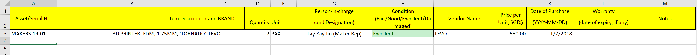
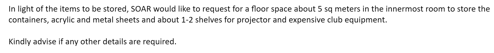

# How To Request For SAC Inventory Storage Space

-----

AUTHOR: JAMESONG7822

LAST UPDATED: 160519

-----

## Objective

This is a guide for club committee members who need a safe storage space for their valuable club items. The space discussed in this guide is the **Student Activity Centre (SAC)**, located at Building 5 level 4.

As mentioned, this *Storage Space* is not meant to be a **DUMP** of club items, but a **safekeep** of **valuable** club items. Do note that for any item in the inventory list, the `maker rep` has the right to reject the storage of the item if he deems so. More details in the [FAQ](#faqs).

## Process

1. Request for an inventory form from maker representative (`makers@rep.sutd.edu.sg`)

   The inventory form is discussed in detail below [here](#Form-Details).

2. Fill the form up with the relevant details. For items with no exact detail (For instance date, price), provide an estimation (basically an educated guess).
   Please refer to the form details section for any form queries [here](#Form-Details).

3. Submit the form back via the maker representative email. The email should also include the following details which are discussed [here](#Email-Details).

## Form Details

The column descriptions are as follows:

| Column Name                              | Description Details                                          |
| ---------------------------------------- | ------------------------------------------------------------ |
| Asset / Serial No.                       | - Self given `Serial Number` for the associated item - Recommended to be in a meaningful format: `<CLUBNAME>_<TYPE>_<ID NUM>` |
| Item Description                         | - Description of the item (Be as specific as possible) - **Storage Containers should be measured and the dimensions (in cm) given, if applicable** |
| Brand                                    | - Associated branding of the item                            |
| Quantity                                 | - Associated count of the item                               |
| Unit                                     | - The quantization property of the item  - Eg: PAX, Box of 10, etc. |
| Person-in-charge (+ Designation)         | - The name of the committee member - Role of the said committee member |
| Condition                                | - Associated "`health`" of the item - Valid: `Fair`, `Good`, `Excellent`, `Damaged` |
| Vendor Name                              | - Usually the company which distributed the item             |
| Price Per Unit (SGD)                     | - SGD value of each unit of the item  - Provide an estimation if an exact value is not certain - Estimation should include the devaluation of the item if applicable |
| Date Of Purchase (YYYY-MM-DD)            | - Note the format of **(YYYY-MM-DD)** - Date of purchase of the item **NOT** item delivery date - Provide an estimation if an exact date is not certain |
| Warranty (Date of expiry, if applicable) | - Associated warranty period of said item, if applicable - Provide a date of expiry (Perishable goods, etc.), if applicable |
| Notes                                    | - Any further notes deemed significant to be raised to the attention of the `maker rep` |

## Email Details

- Inventory list: The form that you have *tediously* filled in step 2 [here](#process)

- Estimated Space Request: Make an estimation based on the size of items to be stored. Please refer to the following image for an example:  
  
  - Include desired room storage location (if applicable)
  - Include any shelf space (if applicable)
  - Seek for further advise or any clarifications
- End of with a `Thank You` and 
- Your name and club committee role

## FAQs

1. **My item is rejected! Why?**  
   The acceptance or rejection of the storage of the item is decided by the `maker rep` and this could be attributed to the following reasons:
   - Item is hazardous (LiPo batteries - bloated with no proper LiPo carrier bags, highly flammable items, etc.). The storage space houses the valuable items of many other clubs and the safety of the items from other clubs must be respected as well.
   - Item is a personal item and **NOT** a club collective usage product. 
     If it is not clear enough, the storage space is for the use of **STORING** club items, and should not be abused to store individual / personal item(s). 
     **UNLESS** the said item(s) is usable by students who visit the SAC (Eg. 3D printer).
2. **My inventory list is not being entertained! Why?**  
   This could be due to multiple reasons as discussed below:
   - `Maker rep` is a very busy person and he may have overlooked the email. Please understand that he is still a `human being` and some leeway and understanding should be given. 
     Dropping him or her a reminder email, or if you know him or her personally, a text or a face to face friendly reminder would suffice!
   - SAC storage space has been depleted. Do understand that the storage space is limited and on a first-come-first-served basis. However, if a reply is required, do not hesitate to reply the email and request for a status update of the SAC space request.
